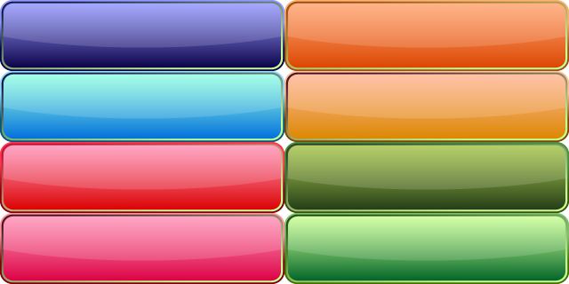
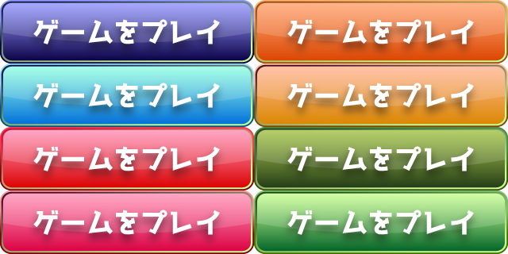
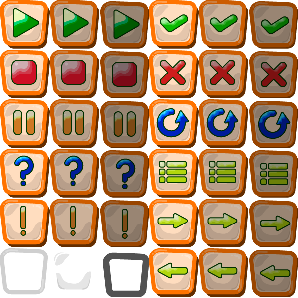
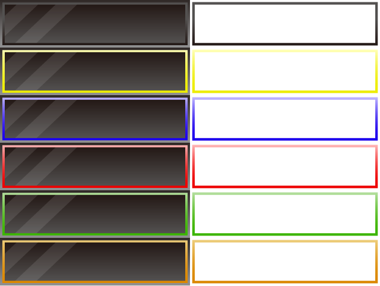
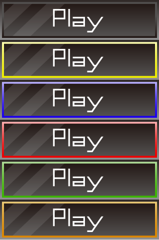

# study-of-gui-parts

## [button-grad-highlight-shine](works/../works/button/grad-highlight-shine)
### Format
AI, SVG, png 320x80 * 8種, png 640x160 * 8種

### Sample

### Example

Font: [ラノベPOP V2](https://flopdesign.booth.pm/items/2328262)

## [button-rounded-toon-grad-utility](works/../works/button/rounded-toon-grad-utility)
### Format
AI, SVG, png 100x100 * 11種 * 3種, png 200x200 * 11種 * 3種

### Sample

## [button-metalic-dark-highlight](works/../works/button/metalic-dark-highlight)
### Format
AI, SVG, png 320x80 * 5種, png 640x160 * 5種

### Sample

### Example

Font: [マキナス](https://moji-waku.com/makinas/)

## 参考サイト
- [ソシャゲでありがちなボタンを簡単に作る方法|ゲームUIネット](https://game-ui.net/?p=222)
