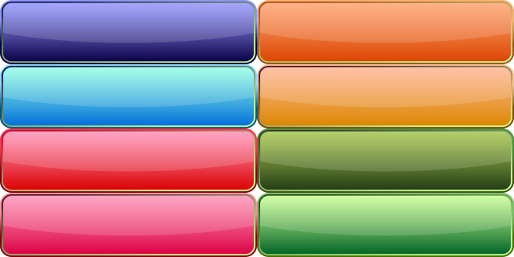

# study-of-gui-parts
## [button-grad-highlight-shine](works/../works/button/grad-highlight-shine)

### Format
AI, SVG, png 320x80 * 8種, png 640x160 * 8種

### Sample

### Example

Font: [ラノベPOP V2](https://flopdesign.booth.pm/items/2328262)

## 参考サイト
- [ソシャゲでありがちなボタンを簡単に作る方法|ゲームUIネット](https://game-ui.net/?p=222)
